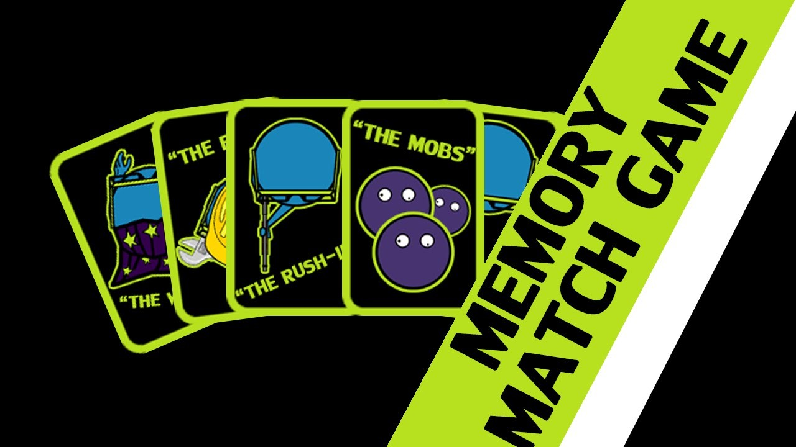
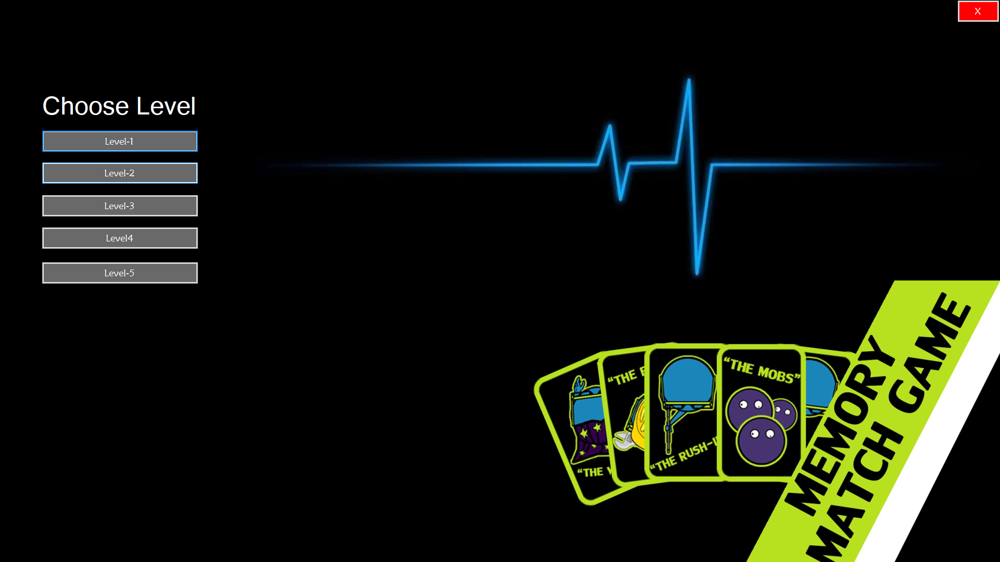
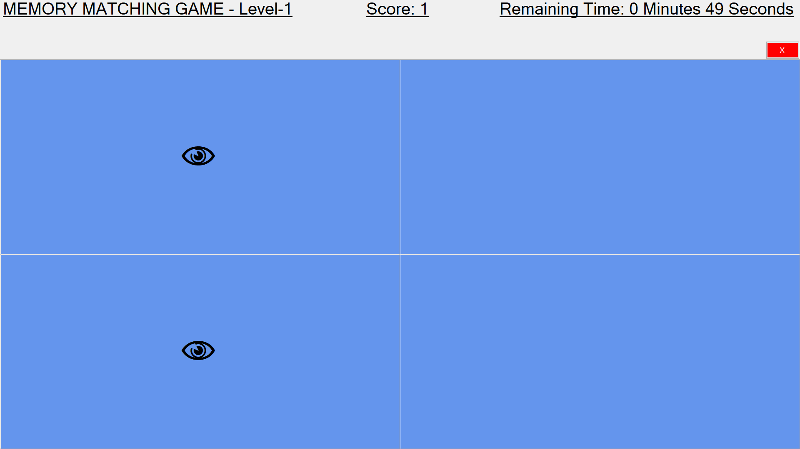
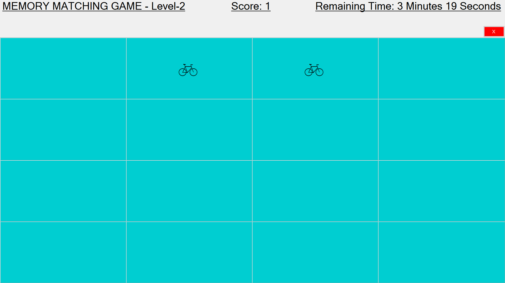
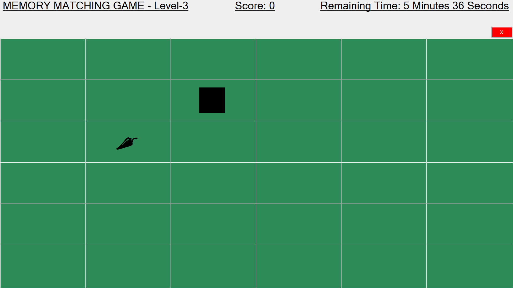
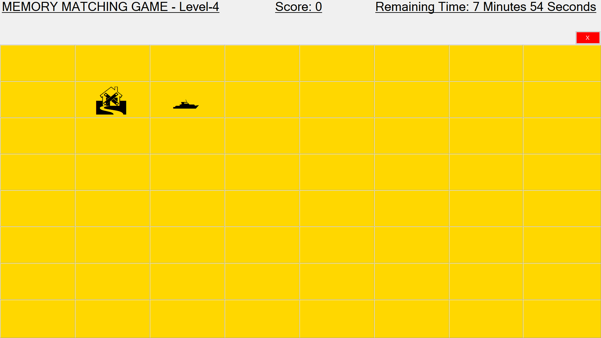
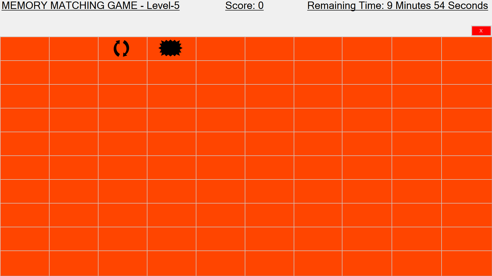
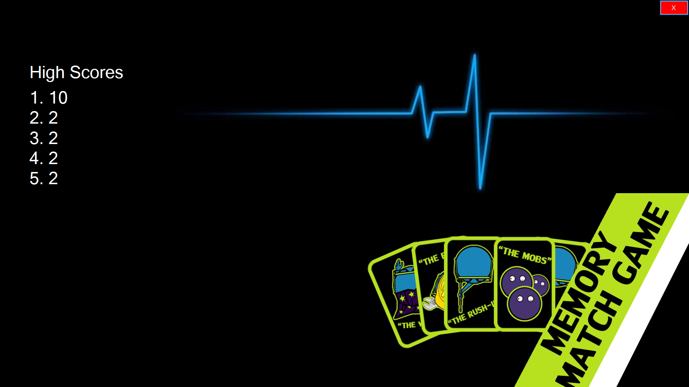
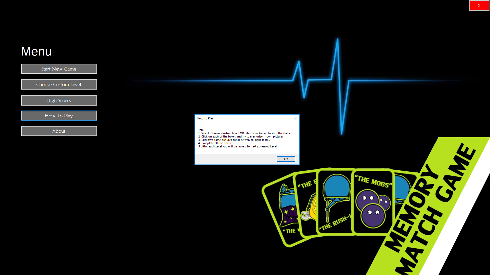
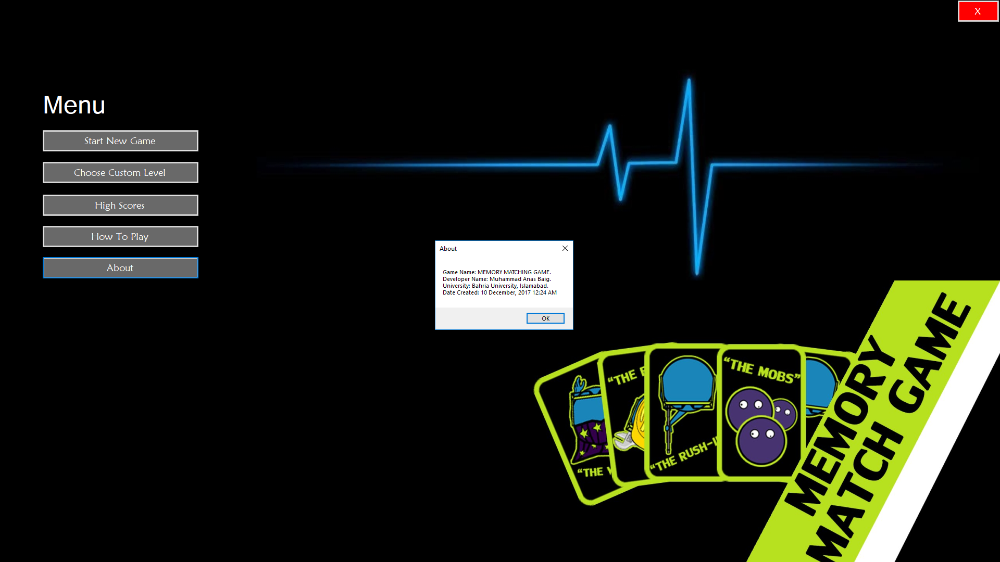

# vp-semester-project
Visual Programming Semester Project

## Home Screen:
<kbd></kbd>
## Main Menu:
<kbd></kbd>
## Choose Custom Level:
<kbd></kbd>
## Level-1:
<kbd></kbd>
## Level-2:
<kbd></kbd>
## Level-3:
<kbd></kbd>
## Level-4:
<kbd></kbd>
## Level-5:
<kbd></kbd>
## High Score:
<kbd></kbd>
## How to Play:
<kbd></kbd>
## About:
<kbd></kbd>
